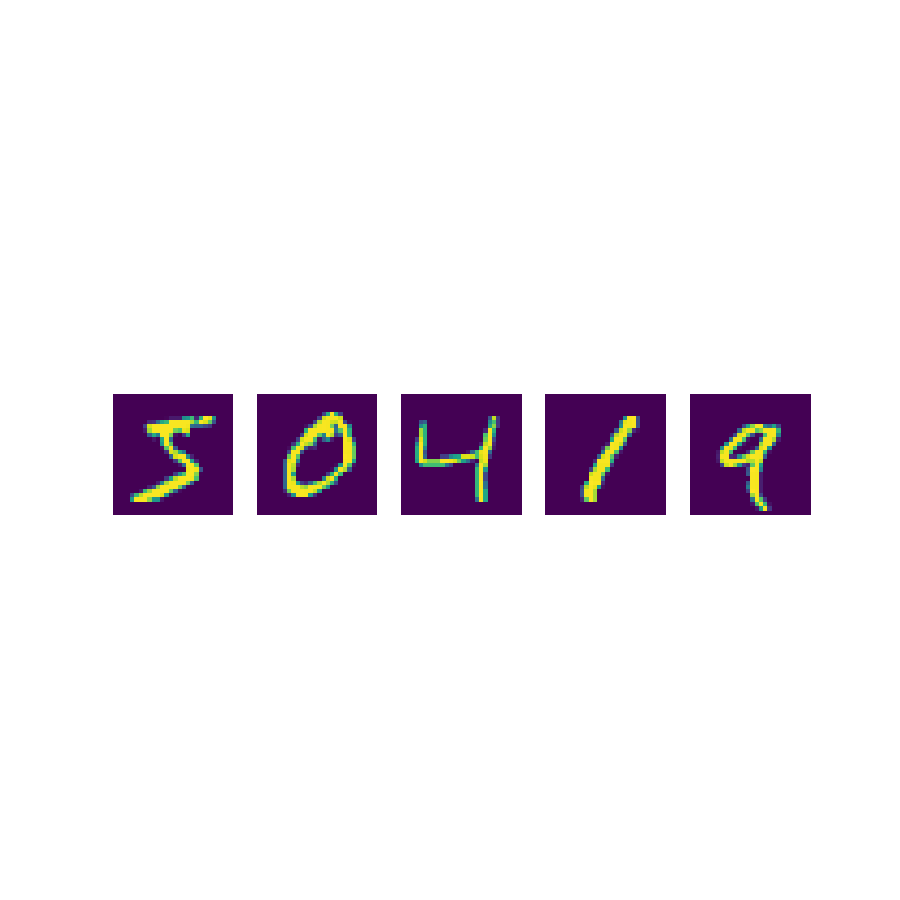
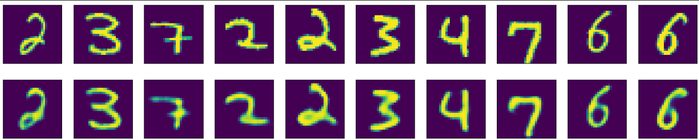

# Overview
In this project, we will explore the concept of Variational Autoencoders (VAEs). We will examine the mathematics behind VAEs, provide a brief introduction to autoencoders, and demonstrate the implementation of both an autoencoder and a variational autoencoder using TensorFlow. The goal is to generate images resembling the MNIST handwritten digits dataset.

  

| *MNIST* |
|:--:|

The explanations can be found in the VAE notebook. I will just show and explain the results here.

# Results
We can view the loss function of VAEs as a tradeoff between reconstruction error and KL divergence, where the control of this tradeoff lies in the size of the latent space. Therefore, if we define a large latent space, we should expect a higher reconstruction error on the training data. To achieve a good performance alongside a regularized latent space, I set the size of the latent space vectors (mean and log variance) to 32. After analyzing the loss value plot, I could have continued the training, but I believe the current results are acceptable and can demonstrate the variances effectively.

Firstly, let's examine the impact of the regularization term on VAEs and AEs. It is evident that a lack of regularization results in a clustered latent space for AEs. One possible explanation is that the model focuses on capturing distinct patterns in the input data, which makes sense as the AE aims to find a mapping that generates the most similar decomposed outputs, thereby seeking a representation that can differentiate various inputs. On the other hand, in VAEs, the utilization of the regularization term prevents the model from encoding data far apart in the latent space and encourages maximum overlap in the returned distributions. This characteristic stems from the probabilistic essence of VAEs, where the encoder learns to map input data to a probability distribution in the latent space, typically a Gaussian distribution.

  

| *VAE latent space* |
|:--:|

  

| *AE latent space* |
|:--:|

Observing the placement of the digit '0,' for instance, we notice that it is not confined to a specific region but is distributed across regions where the digits are similar to zero. This distribution contributes to another distinction between VAEs and AEs: the smooth interpolation between two encoded points in latent space. For example in following plots, when focusing on images in the middle stages of the process, in VAE, these images display characteristics resembling a blend of digits '2' and '6.' In contrast, in AE, the intermediate images only resemble one of '2' or '6,' and the output between these two clusters appears to lack inspiration from either of them.

|  |  |
|:--:|:--:|
| *VAE* | *AE* |

In conclusion, although our VAE still has a lot of room for improvement, examining its outputs shows how the model tries to find patterns to encode inputs more effectively.

|  |  |
|:--:|:--:|
| *VAE* | *AE* |

Second image (digit 3) is an example of smooth interpolation. Notice how the model attempts to create a continuous space for its encoder. This exemplifies the capability of the Variational Autoencoder (VAE) as it learns to represent inputs in a structured and smooth manner. Autoencoders (AE) in general aim to encode input data into a lower-dimensional representation while retaining important features for reconstruction.

# Refrences
- [Auto-Encoding Variational Bayes by Diederik P Kingma, Max Welling](https://arxiv.org/abs/1312.6114)
- [Understanding Variational Autoencoders](https://towardsdatascience.com/understanding-variational-autoencoders-vaes-f70510919f73)
- [Variational autoencoders by Matthew N. Bernstein](https://mbernste.github.io/posts/vae/)
- [Variational autoencoders by Jeremy Jordan](https://www.jeremyjordan.me/variational-autoencoders/)
- [What is a variational autoencoder?](https://jaan.io/what-is-variational-autoencoder-vae-tutorial/)